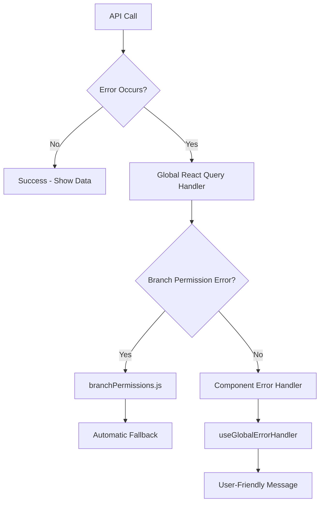

# Global Error Handling Architecture

## Overview

We've implemented a **centralized error handling system** that eliminates code duplication across React Query hooks and components. This architecture provides consistent error handling patterns throughout the application.

## Architecture Components

### 1. **Global React Query Error Handler**

📁 `src/lib/reactQuery.js`

**Purpose**: Handles all React Query errors in one place

- ✅ **Branch permission errors**: Automatic fallback to default branch
- ✅ **Authentication errors**: Token cleanup and login redirect
- ✅ **Retry logic**: Smart retry prevention for permission errors
- ✅ **Logging**: Consistent error logging across the app

```javascript
// All React Query operations automatically use this error handler
const { data, error, loading } = useFoodCategories(branchId);
// No need to handle branch permission errors manually!
```

### 2. **Global Error Handler Hook**

📁 `src/hooks/useGlobalErrorHandler.js`

**Purpose**: Provides consistent error handling patterns for components

- ✅ **Non-permission errors**: HTTP 404, 500, 400, etc.
- ✅ **Success/Warning/Info messages**: Consistent message patterns
- ✅ **Vietnamese localization**: User-friendly error messages

```javascript
const { handleNonPermissionError, handleSuccess } = useGlobalErrorHandler();

// In useEffect
useEffect(() => {
  if (error) {
    handleNonPermissionError(error, "Không thể tải dữ liệu.");
  }
}, [error, handleNonPermissionError]);
```

### 3. **Branch Permissions Utility**

📁 `src/utils/branchPermissions.js`

**Purpose**: Core logic for handling branch permission scenarios

- ✅ **Error detection**: Identifies 302/403/401 errors
- ✅ **Fallback logic**: Automatic switch to default branch
- ✅ **Session management**: Token cleanup on expiration

## How It Works Together



## Migration from Individual Hook Error Handling

### ❌ **Before: Duplicated Error Handling**

```javascript
// In every hook:
export const useFoodCategories = (branchId) => {
  return useQuery({
    queryKey: FOOD_CATEGORY_QUERY_KEYS.list(branchId),
    queryFn: () => foodCategoryService.getFoodCategories(branchId),
    onError: async (error) => {
      // Branch permission handling (duplicated everywhere!)
      const handled = await handleBranchPermissionError(error, branchId);
      if (handled) return;

      // Custom error messages (duplicated everywhere!)
      if (error.response?.status === 404) {
        message.error("Service not found");
      }
      // ... more duplication
    },
  });
};
```

### ✅ **After: Clean, Focused Hooks**

```javascript
// Hooks are now clean and focused:
export const useFoodCategories = (branchId) => {
  return useQuery({
    queryKey: FOOD_CATEGORY_QUERY_KEYS.list(branchId),
    queryFn: () => foodCategoryService.getFoodCategories(branchId),
    // That's it! No error handling duplication
  });
};
```

## Usage Examples

### 1. **For New React Query Hooks**

```javascript
// src/hooks/queries/useOrders.js
export const useOrders = (branchId) => {
  return useQuery({
    queryKey: ["orders", { branchId }],
    queryFn: () => orderService.getOrders(branchId),
    // No error handling needed - it's global!
  });
};
```

### 2. **For Components with Custom Error Handling**

```javascript
// src/components/OrderManagement.js
import { useGlobalErrorHandler } from "../hooks/useGlobalErrorHandler";

const OrderManagement = () => {
  const { data: orders, error } = useOrders(branchId);
  const { handleNonPermissionError, handleSuccess } = useGlobalErrorHandler();

  useEffect(() => {
    if (error) {
      // Only handle non-permission errors (permission errors are global)
      handleNonPermissionError(error, "Không thể tải dữ liệu đơn hàng.");
    }
  }, [error, handleNonPermissionError]);

  const handleCreateOrder = async (orderData) => {
    try {
      await createOrder(orderData);
      handleSuccess("Tạo đơn hàng thành công!");
    } catch (error) {
      // Error is handled globally, but you can add custom logic here
    }
  };
};
```

### 3. **For Components with No Custom Error Handling**

```javascript
// src/components/SimpleOrderList.js
const SimpleOrderList = () => {
  const { data: orders, loading } = useOrders(branchId);

  // No error handling needed at all!
  // Branch permissions: handled globally
  // Other errors: handled globally
  // Just focus on your UI logic!

  return <div>{loading ? <Spin /> : <OrderTable data={orders} />}</div>;
};
```

## Benefits

### 🎯 **For Developers**

- ✅ **No code duplication**: Write error handling once, use everywhere
- ✅ **Consistent patterns**: Same error handling across all features
- ✅ **Focused hooks**: Hooks only handle data fetching logic
- ✅ **Easy to maintain**: Change error handling in one place

### 🎯 **For Users**

- ✅ **Consistent UX**: Same error messages and behavior everywhere
- ✅ **Automatic recovery**: Branch permission issues resolved automatically
- ✅ **Better feedback**: Clear, localized error messages
- ✅ **Reliable experience**: No more getting "stuck" on permission errors

### 🎯 **For System**

- ✅ **Performance**: Smart retry logic prevents unnecessary API calls
- ✅ **Security**: Proper token cleanup and authentication handling
- ✅ **Scalability**: Easy to add new error types and handling logic

## Adding New Error Types

### 1. **Global Error Types**

Add to `src/lib/reactQuery.js`:

```javascript
const handleGlobalQueryError = async (error, query) => {
  // Handle branch permissions
  if (isBranchPermissionError(error)) { ... }

  // Add new global error type here
  if (isNetworkError(error)) {
    await handleNetworkError(error);
    return;
  }
};
```

### 2. **Component-Specific Error Types**

Add to `useGlobalErrorHandler.js`:

```javascript
const handleSpecificError = useCallback((error, context) => {
  // Handle errors that need component context
}, []);
```

## Testing Strategy

### 1. **Global Error Handler Tests**

```javascript
// Test that branch permission errors are handled correctly
// Test that retry logic works properly
// Test that fallback scenarios work
```

### 2. **Component Error Handler Tests**

```javascript
// Test that non-permission errors show correct messages
// Test that success messages are displayed
// Test error recovery scenarios
```

## Future Enhancements

### 1. **Error Analytics**

- Track error patterns
- Monitor error rates by branch/user
- Alert on unusual error spikes

### 2. **Smart Error Recovery**

- Retry with exponential backoff
- Cached data fallbacks
- Offline mode support

### 3. **User Feedback**

- Error reporting to admins
- User feedback collection
- Automatic bug reports

## Summary

This architecture transforms error handling from a **scattered, duplicated concern** into a **centralized, consistent system**. New features automatically inherit robust error handling without any additional code!

**Key Principle**: _Handle errors once, benefit everywhere_ 🚀
